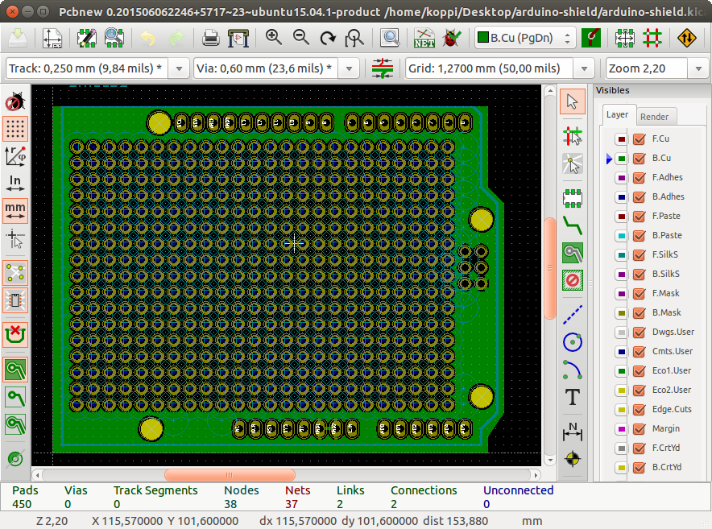

## KiCad Arduino Shield for PCB milling


Schematics


Layout

### pcbgcode

```bash
$ make
./drl-optimize.py arduino-shield.drl > arduino-shield.opt.drl
# without probing
pcb2gcode --basename=arduino-shield --drill=arduino-shield.opt.drl --front=arduino-shield-F_Cu.gbr --back=arduino-shield-B_Cu.gbr --outline=arduino-shield-Cmts_User.gbr --output-dir=. --postamble=postamble.ngc --preamble=preamble.ngc --dpi=1000 --metric=true --metricoutput=true --mirror-absolute=false --optimise=true --zchange=40.0000 --zero-start=true --zsafe=0.5000 --extra-passes=0 --mill-feed=600 --mill-speed=10000 --offset=1.0 --zwork=-0.075 --drill-feed=1000 --drill-front=false --drill-speed=20000 --milldrill=false --nog81=false --onedrill=true --zdrill=-2.0 --bridges=0.5000 --bridgesnum=2 --cut-feed=600 --cut-infeed=10.0000 --cut-speed=10000 --cutter-diameter=2.0000 --fill-outline=true --outline-width=0.2 --zbridges=-0.6000 --zcut=-1.6500 --al-back=false --al-front=false --al-probefeed=100 --al-x=5.0000 --al-y=5.0000 --software=LinuxCNC
Importing preamble... DONE
Importing postamble... DONE
Importing front side... DONE.
Importing back side... DONE.
Importing outline... DONE.
Exporting back... 
Warning: pcb2gcode hasn't been able to fulfill all clearance requirements and tried a best effort approach instead. You may want to check the g-code output and possibly use a smaller milling width.
DONE. (Height: 56.9021mm Width: 73.2216mm)
Exporting front... 
Warning: pcb2gcode hasn't been able to fulfill all clearance requirements and tried a best effort approach instead. You may want to check the g-code output and possibly use a smaller milling width.
DONE. (Height: 56.9021mm Width: 73.2216mm)
Exporting outline... DONE. (Height: 56.9021mm Width: 73.2216mm)
Importing drill... DONE.
Exporting drill... DONE.
END.
# with probing
pcb2gcode --basename=arduino-shield-with-probe --drill=arduino-shield.opt.drl --front=arduino-shield-F_Cu.gbr --back=arduino-shield-B_Cu.gbr --outline=arduino-shield-Cmts_User.gbr --output-dir=. --postamble=postamble.ngc --preamble=preamble.ngc --dpi=1000 --metric=true --metricoutput=true --mirror-absolute=false --optimise=true --zchange=40.0000 --zero-start=true --zsafe=0.5000 --extra-passes=0 --mill-feed=600 --mill-speed=10000 --offset=1.0 --zwork=-0.075 --drill-feed=1000 --drill-front=false --drill-speed=20000 --milldrill=false --nog81=false --onedrill=true --zdrill=-2.0 --bridges=0.5000 --bridgesnum=2 --cut-feed=600 --cut-infeed=10.0000 --cut-speed=10000 --cutter-diameter=2.0000 --fill-outline=true --outline-width=0.2 --zbridges=-0.6000 --zcut=-1.6500 --al-back=true --al-front=true --al-probefeed=100 --al-x=5.0000 --al-y=5.0000 --software=LinuxCNC
Importing preamble... DONE
Importing postamble... DONE
Importing front side... DONE.
Importing back side... DONE.
Importing outline... DONE.
Exporting back... 
Warning: pcb2gcode hasn't been able to fulfill all clearance requirements and tried a best effort approach instead. You may want to check the g-code output and possibly use a smaller milling width.
DONE. (Height: 56.9021mm Width: 73.2216mm)
Exporting front... 
Warning: pcb2gcode hasn't been able to fulfill all clearance requirements and tried a best effort approach instead. You may want to check the g-code output and possibly use a smaller milling width.
DONE. (Height: 56.9021mm Width: 73.2216mm)
Exporting outline... DONE. (Height: 56.9021mm Width: 73.2216mm)
Importing drill... DONE.
Exporting drill... DONE.
END.
```

### fabrication process

See [Video](https://www.youtube.com/watch?v=2nGcliWefek). On a CNC run ```arduino-shield-with-probe_back.ngc```, then ```arduino-shield-with-probe_drill.ngc```, then ```arduino-shield-with-probe_outline.ngc```.


